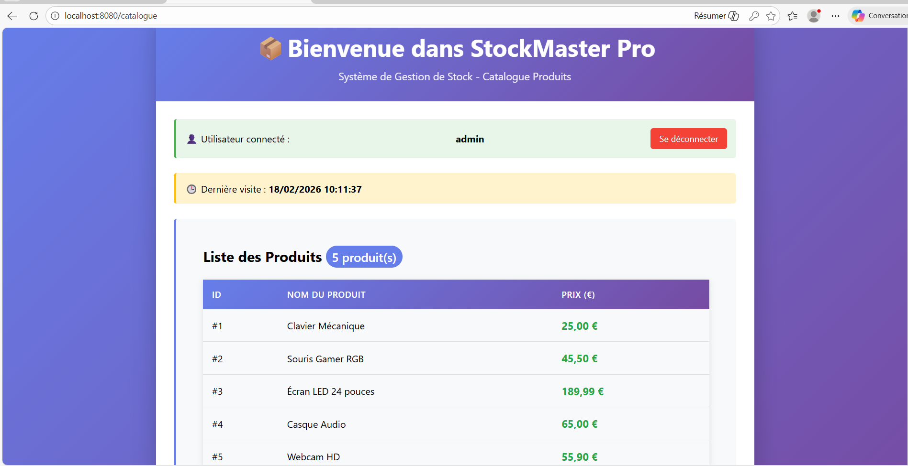

📦 StockMaster Pro – Application JEE
🎯 Objectif

Développement d’une application web Java EE respectant l’architecture MVC avec séparation stricte des couches (Controller – Service – DAO – View).

🏗️ Architecture

Flux applicatif :

Navigateur
⬇
Servlet (Contrôleur)
⬇
Service (Métier)
⬇
DAO (Accès aux données)
⬇
Base de données

La Servlet communique uniquement avec l’interface Service.
Le Service communique avec l’interface DAO.

📁 Structure des Packages

com.stock.model → Bean Produit

com.stock.controller → Servlets

com.stock.service → Interface Service

com.stock.service.impl → Implémentations métier

com.stock.dao → Interface DAO

com.stock.dao.impl → Implémentations JDBC

com.stock.filter → Filtre d’authentification

WEB-INF/vues/ → JSP protégées

🔐 Fonctionnalités

✔ Affichage du catalogue (JSTL + EL)
✔ Authentification avec Session
✔ Sécurisation via Filter
✔ Gestion du Cookie lastVisit (24h)
✔ Accès base de données via JDBC + PreparedStatement

⚙️ Technologies

Java 17 • Servlets • JSP • JSTL • JDBC • Tomcat 10 • MySQL/H2

📸 Capture d’écran

